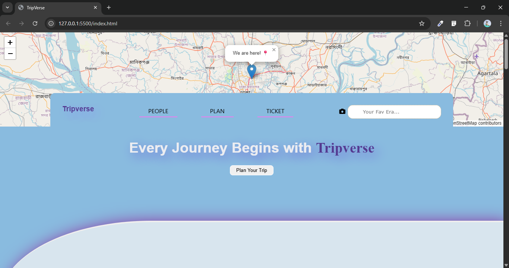

# 🌍 Tripverse — Travel Planning Platform

**Tripverse** is your all-in-one platform to **plan trips, share itineraries, and connect with fellow travelers**.  
Discover destinations, match with travel partners, and organize your travel plans effortlessly!  

> 💡 **Note:** This is my **first front-end project** as a beginner developer.

---

## 🚀 Live Demo
[View Website](#)  <!--https://github.com/nishatjahandev/Tripverse/ --> 

---

## ✨ Features
- **Plan and share trips** with friends or the Tripverse community  
- **Find travel partners** with similar interests and schedules  
- **Explore destinations** with images, guides, and interactive maps  
- **Responsive design** optimized for Mobile, Tablet, and Desktop  

---

## 🛠️ Technologies Used
- **HTML5**  
- **CSS3**  
- **Leaflet.js** — for interactive maps  
- **GitHub Pages** — for hosting  

---

## 📸 Preview
  

---

## 📝 Project Highlights
- This project helped me **learn how to structure a responsive website**.  
- Practiced **interactive maps using Leaflet.js**.  
- Gained experience with **front-end design and layout**.  
- Learned how to **deploy a website using GitHub Pages**.  

---

## 👩‍💻 Author
**Nishat Jahan**  
Beginner Front-End Developer  
Tripverse is my **first project**, showcasing my skills in building interactive, responsive websites.  

